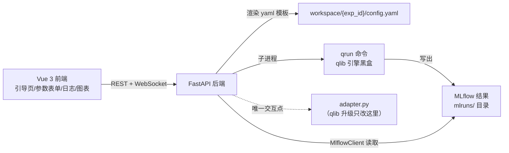

# Qlib 量化实验 Web 平台开发计划

## 背景与核心设计

Qlib（微软量化研究平台，工作区 `d:\ai-work\qlib`）没有官方 UI。我们构建独立的 Web 界面，核心设计原则：

- **进程隔离**：后端绝不 `import qlib`，只通过 `qrun <config.yaml>` 子进程驱动实验。qlib 升级不会破坏 UI。
- **只依赖稳定面**：yaml 配置格式 + `qrun` 命令 + MLflow 结果目录（这三样是 qlib 的对外契约）。
- **适配层集中**：所有与 qlib 交互的代码收在唯一的 `adapter.py` 中。
- **版本锁死**：`pyqlib==0.9.7` 锁定，升级需主动决策并验证。

## 架构



## 目录结构（全部新建于 `d:\ai-work\qlib\ui-project\`）

```
ui-project/
├── backend/
│   ├── main.py          # FastAPI 路由：模型列表/创建实验/日志/报告/数据下载
│   ├── adapter.py       # 唯一 qlib 交互层：模板解析、占位符渲染、qrun 校验、MLflow 读取
│   ├── runner.py        # 任务管理器：线程+子进程执行 qrun、日志逐行采集、WS 广播
│   ├── requirements.txt # pyqlib==0.9.7 锁死
│   ├── templates/       # 模型 yaml 模板（顶部 # meta: {...} JSON 注释声明中文名/分组/参数表单 schema）
│   └── workspace/       # 每实验一个目录：config.yaml + mlruns/
└── frontend/            # Vite + Vue 3 + TypeScript + Element Plus + ECharts
```

## 后端 API 设计

| 路由 | 功能 |
|---|---|
| `GET /api/models` | 扫描 templates/ 返回模型卡片数据（中文名、分组、说明、GPU 标签、参数 schema） |
| `POST /api/experiments` | 接收表单参数 → 渲染 yaml（日期按 70/15/15 切分 train/valid/test 段）→ 提交后台执行 |
| `GET /api/experiments` | 实验列表（内存字典，不引入数据库） |
| `GET /api/experiments/{id}/logs` + `WS /ws/logs/{id}` | 日志拉取 + 实时推送 |
| `GET /api/experiments/{id}/report` | MlflowClient 读指标（IC/年化收益/信息比率/最大回撤，映射中文键名）+ artifacts 曲线 |
| `POST /api/data/download`、`GET /api/data/status` | 子进程执行 `scripts/get_data.py`；检测 `~/.qlib/qlib_data/cn_data` 就绪状态 |

## 前端四页设计（含引导提示）

1. **新建实验（首页）**：el-steps 三步引导条（选模型→配参数→运行）；模型卡片墙按"树模型/深度学习/进阶"分组，带中文说明与资源标签；参数表单按模型 `params_schema` 动态生成，每字段配 el-tooltip 中文解释；数据未下载时顶部 el-alert 提供一键下载按钮。
2. **实验进行页**：阶段步骤条（等待/训练/回测/完成/失败）；黑底日志区自动滚动可暂停；WebSocket 实时推送，断线降级轮询。
3. **报告页**：4 个指标卡（含解释 tooltip）+ ECharts 累计收益/回撤曲线；无曲线数据显示占位说明。
4. **历史列表**：el-table 展示全部实验，可查看报告。

## 实施步骤

1. **后端骨架**：创建 `main.py` / `adapter.py` / `runner.py`，先支持 LightGBM 单模型跑通"提交→日志→指标"闭环
2. **模型模板**：从 `examples/benchmarks/` 参数化 25 份官方 yaml（占位符：日期区间/股票池/资金/topk/n_drop），首批完成 LightGBM、XGBoost，其余批量处理
3. **前端工程**：Vite + Vue3 + Element Plus 脚手架、路由、主布局、API 封装
4. **新建实验页 + 进行页**：引导条、动态表单、WebSocket 日志流
5. **报告页 + 历史页**：MLflow 指标中文映射、ECharts 图表
6. **环境与联调**：安装 `pyqlib==0.9.7`、执行 `scripts/get_data.py` 下载 A 股数据、端到端跑一次 LightGBM 实验验证

## 关键约定

- 每步完成后先汇报，经确认再进入下一步（不再自行连续执行）
- 不创建测试文件与总结文档；不改动 qlib 源码仓库任何现有文件
- 环境安装（pip/npm）在用户确认计划后才执行